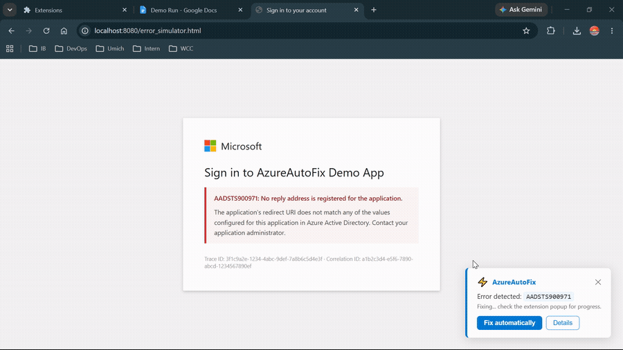
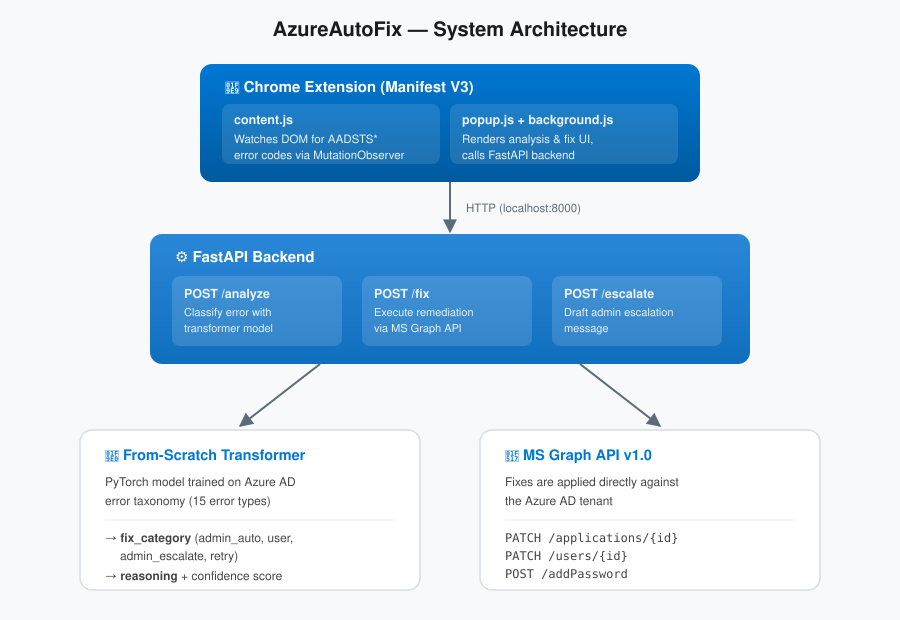

# ⚡ AzureAutoFix

> An agentic Azure AD error resolution system. Detects authentication errors, reasons about them with a from-scratch transformer, and fixes them automatically via the MS Graph API — in under 10 seconds.



---

## What it does

When you hit an Azure AD error (e.g. `AADSTS900971`, `AADSTS50057`), AzureAutoFix:

1. **Detects** the error — via Chrome extension (automatic) or web app (manual paste)
2. **Classifies** it — using a from-scratch transformer trained on Azure AD error taxonomy
3. **Routes** it — auto-fix, user-guided steps, or admin escalation with a pre-drafted message
4. **Fixes it** — by calling the MS Graph API directly (admin errors resolved in seconds)

---

## Architecture



---

## Supported Errors

| Error Code | Issue | Resolution |
|---|---|---|
| `AADSTS900971` | Missing redirect URI | ✅ Auto-fix via Graph API |
| `AADSTS50057` | Account disabled | ✅ Auto-fix via Graph API |
| `AADSTS50055` | Password expired | ✅ Auto-fix via Graph API |
| `AADSTS700011` | Invalid client credentials | ✅ Auto-fix via Graph API |
| `AADSTS90094` | Admin consent required | ✅ Auto-fix via Graph API |
| `AADSTS70011` | Invalid scope | ✅ Auto-fix via Graph API |
| `AADSTS50053` | Account locked out | ✅ Auto-fix via Graph API |
| `AADSTS50126` | Invalid credentials | 📋 User-guided steps |
| `AADSTS50058` | Silent sign-in failed | 📋 User-guided steps |
| `AADSTS65001` | User consent missing | 📋 User-guided steps |
| `AADSTS700016` | App not in tenant | 📋 User-guided steps |
| `AADSTS50076` | MFA required | 📋 User-guided steps |
| `AADSTS700082` | Refresh token expired | 📋 User-guided steps |
| `AADSTS20050` | External user not found | 📧 Escalate to admin |
| `AADSTS90033` | Transient error | 🔄 Retry |

---

## Stack

| Layer | Tech |
|---|---|
| LLM | From-scratch PyTorch transformer (trained on Azure AD taxonomy) |
| Backend | FastAPI + httpx |
| Graph API | MS Graph API v1.0 |
| Frontend | Streamlit |
| Extension | Chrome Manifest V3 |
| Deploy | Docker + Railway |

---

## Quick Start

### 1. Clone + install

```bash
git clone https://github.com/aminabk99/AzureAutoFix
cd AzureAutoFix
python -m venv venv && source venv/bin/activate  # Windows: venv\Scripts\activate
pip install -r requirements.txt
```

### 2. Train the model

Open `model/train.py` in [Google Colab](https://colab.research.google.com/) (free GPU), run all cells, then download:
- `azure_error_model.pt` → place in `model/`
- `vocab.json` → place in `model/`

### 3. Configure Azure

```bash
cp .env.example .env
# Fill in AZURE_CLIENT_ID, AZURE_CLIENT_SECRET, AZURE_TENANT_ID
```

Register an app in Azure Portal with these Graph API permissions (grant admin consent):
- `User.ReadWrite.All`
- `Application.ReadWrite.All`
- `Directory.ReadWrite.All`
- `DelegatedPermissionGrant.ReadWrite.All`

### 4. Run

```bash
# Backend
uvicorn backend.main:app --reload --port 8000

# Frontend (new terminal)
streamlit run frontend/app.py
```

Or with Docker:

```bash
docker-compose up --build
```

### 5. Load Chrome extension

1. Open `chrome://extensions`
2. Enable **Developer mode**
3. Click **Load unpacked** → select the `extension/` folder

---

## Project Structure

```
AzureAutoFix/
├── model/
│   ├── train.py          # From-scratch transformer training (run in Colab)
│   ├── inference.py      # Model loader + classify() function
│   ├── azure_error_model.pt  # Trained weights (after training)
│   └── vocab.json        # Token vocabulary (after training)
├── backend/
│   ├── main.py           # FastAPI routes
│   ├── graph_api.py      # MS Graph API client
│   └── escalation.py     # Admin message generator
├── frontend/
│   └── app.py            # Streamlit web app
├── extension/
│   ├── manifest.json     # Chrome extension config
│   ├── content.js        # DOM watcher (error detection)
│   ├── background.js     # Service worker (API calls)
│   ├── popup.html        # Extension popup UI
│   └── popup.js          # Popup logic
├── data/
│   └── azure_errors.json # Training dataset (15 errors with causes + fixes)
├── docker-compose.yml
├── requirements.txt
└── .env.example
```

---

## Resume Bullet

> Built an agentic Azure AD error resolution system featuring a from-scratch transformer trained on AD error taxonomies, MS Graph API integration for automated fixes, and role-aware remediation — resolving admin-level issues in under 10 seconds with full reasoning transparency

---

## Deployment

Deploy backend + frontend to [Railway](https://railway.app) (free tier):

```bash
# Install Railway CLI
npm install -g @railway/cli
railway login
railway init
railway up
```

---

*Built as part of a 2-month AI portfolio sprint. July 2026.*
